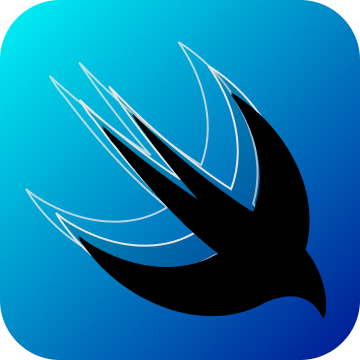
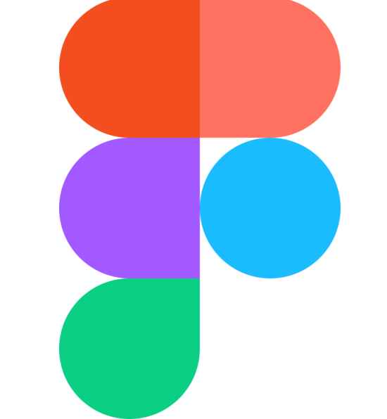

<h1 align="center">Hi there! 👋</h1>

I'm Gustavo, **Senior Frontend Engineer** currently working at [Globant](https://globant.com). I love coding, solving problems and creating new things! I like computers since I was a child, I was always fascinated about them. A bit later, I started to coding my first apps, websites and tools.Currently, I'm working on a side project that mixes technology and 🐕 .

## Languages & Frameworks

     

 

### Currently learning

  

 

## Services & Tools

     

 

## Featured projects

I've worked on several projects, but these two are
the ones that had more impact at social level.

<h3>

Aprendo en Casa
</h3>

Flutter (with modules developed by hand in Swift and Kotlin) application for the [Ministerio de Educación del Perú](https://www.gob.pe/minedu) that helped teachers and students to teach and study in the pandemic period.

<h3>

Tapuy
</h3>

Flutter & PWA application for the [national water provider entity](https://www.gob.pe/institucion/sedapal/institucional). This application is used by people in extreme poverty to inform to SEDAPAL how much water (and in which conditions) they are receiving, as well drivers to notify people the water cistern is coming to these clanships.

 

## Contact me!

- Wanna talk? I'm available at  for DM.
- If you're spanish native speaker, look at some of my answers at .
- Are you a talent hunter? please visit my .
